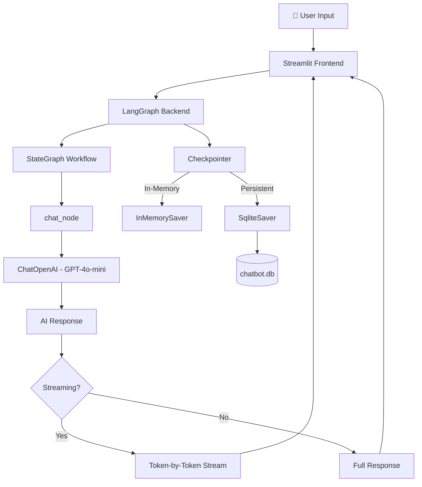
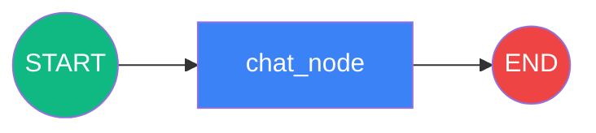

# 🤖 LangGraph-Based Stateful Conversational AI Chatbot with Streaming Interface

A **stateful conversational AI chatbot** built using [LangGraph](https://langchain-ai.github.io/langgraph/) with graph-based workflow orchestration and thread-based session management. Features **persistent memory** using SQLite for storing and retrieving multiple chat sessions, an interactive **Streamlit** interface with seamless conversation switching, and **token-level streaming** for real-time AI responses.

---

## 📑 Table of Contents

- [Features](#-features)
- [Architecture](#-architecture)
- [Project Structure](#-project-structure)
- [Tech Stack](#-tech-stack)
- [Getting Started](#-getting-started)
  - [Prerequisites](#prerequisites)
  - [Installation](#installation)
  - [Environment Variables](#environment-variables)
  - [Running the Application](#running-the-application)
- [Application Versions](#-application-versions)
  - [v1 — Basic Chatbot (Jupyter Notebook)](#v1--basic-chatbot-jupyter-notebook)
  - [v2 — Streamlit Frontend (Invoke Mode)](#v2--streamlit-frontend-invoke-mode)
  - [v3 — Streaming Interface](#v3--streaming-interface)
  - [v4 — Multi-Thread Session Management](#v4--multi-thread-session-management)
  - [v5 — Persistent SQLite Database](#v5--persistent-sqlite-database)
- [How It Works](#-how-it-works)
  - [LangGraph Workflow](#langgraph-workflow)
  - [State Management](#state-management)
  - [Checkpointing & Memory](#checkpointing--memory)
  - [Token-Level Streaming](#token-level-streaming)
- [Screenshots](#-screenshots)
- [License](#-license)

---

## ✨ Features

| Feature | Description |
|---|---|
| **Graph-Based Workflow** | Uses LangGraph's `StateGraph` to define a structured, node-edge conversational pipeline |
| **Stateful Conversations** | Maintains full conversation context across messages using LangGraph's checkpointing |
| **Thread-Based Sessions** | Each conversation gets a unique thread ID, enabling multiple independent chat sessions |
| **Persistent Memory (SQLite)** | Stores conversations in a SQLite database — sessions survive server restarts |
| **Token-Level Streaming** | AI responses stream token-by-token in real time using `st.write_stream()` |
| **Conversation Switching** | Sidebar UI lets users switch between past conversations or start new ones |
| **Interactive Streamlit UI** | Clean chat interface with message history, user/assistant roles, and real-time updates |

---

## 🏗 Architecture



### LangGraph State Flow



--

## 🛠 Tech Stack

| Technology | Purpose |
|---|---|
| [LangGraph](https://langchain-ai.github.io/langgraph/) | Graph-based stateful workflow orchestration |
| [LangChain](https://python.langchain.com/) | LLM integration & message handling |
| [OpenAI GPT-4o-mini](https://openai.com/) | Language model (via OpenRouter) |
| [OpenRouter](https://openrouter.ai/) | LLM API gateway |
| [Streamlit](https://streamlit.io/) | Interactive web UI framework |
| [SQLite](https://www.sqlite.org/) | Persistent conversation storage |
| Python 3.11+ | Programming language |

---

## 🚀 Getting Started

### Prerequisites

- **Python 3.11+** installed
- An **OpenRouter API key** (or modify to use OpenAI directly)

### Installation

1. **Clone the repository**
   ```bash
   git clone https://github.com/rajgupta19/LangGraph-Based-Stateful-Conversational-AI-Chatbot-with-Streaming-Interface.git
   cd LangGraph-Based-Stateful-Conversational-AI-Chatbot-with-Streaming-Interface
   ```

2. **Create and activate a virtual environment**
   ```bash
   python -m venv myenv
   
   # Windows
   myenv\Scripts\activate
   
   # macOS/Linux
   source myenv/bin/activate
   ```

3. **Install dependencies**
   ```bash
   pip install langgraph langchain-core langchain-openai streamlit python-dotenv langgraph-checkpoint-sqlite
   ```

### Environment Variables

Create a `.env` file in the project root:

```env
OPENROUTER_API_KEY=your_openrouter_api_key_here
```

### Running the Application

Choose the version you want to run:

```bash
# v2: Basic frontend (invoke mode)
streamlit run streamlit_frontend.py

# v3: Streaming interface
streamlit run streamlit_frontend_streaming.py

# v4: Multi-thread session management (in-memory)
streamlit run streamlit_frontend_threading.py

# v5: Full-featured with SQLite persistence (recommended)
streamlit run streamlit_frontend_database.py
```

The app will open at **http://localhost:8501**.

## 🔍 How It Works

### LangGraph Workflow

The chatbot is built as a **directed graph** with a single processing node:

```python
graph = StateGraph(ChatState)
graph.add_node("chat_node", chat_node)    # LLM processing node
graph.add_edge(START, "chat_node")         # Entry point
graph.add_edge("chat_node", END)           # Exit point
chatbot = graph.compile(checkpointer=checkpointer)
```

This structure can be easily extended with additional nodes (e.g., tool calling, routing, moderation) by adding more nodes and conditional edges.

### State Management

Conversation state is managed using a `TypedDict` with LangGraph's `add_messages` reducer:

```python
class ChatState(TypedDict):
    messages: Annotated[list[BaseMessage], add_messages]
```

The `add_messages` annotation ensures new messages are **appended** to the existing list rather than overwriting it, preserving full conversation context.

### Checkpointing & Memory

| Checkpointer | Persistence | Use Case |
|---|---|---|
| `MemorySaver` | In-memory (volatile) | Notebook prototyping |
| `InMemorySaver` | In-memory (volatile) | Development & testing |
| `SqliteSaver` | Disk (persistent) | Production deployment |

Each conversation is identified by a unique `thread_id` in the config:
```python
config = {"configurable": {"thread_id": "unique-thread-id"}}
chatbot.invoke({"messages": [HumanMessage(content="Hello")]}, config=config)
```

### Token-Level Streaming

Instead of waiting for the full response, the streaming versions use LangGraph's `stream()` method:

```python
for message_chunk, metadata in chatbot.stream(
    {"messages": [HumanMessage(content=user_input)]},
    config=CONFIG,
    stream_mode="messages"
):
    if isinstance(message_chunk, AIMessage):
        yield message_chunk.content
```

This is rendered in Streamlit using `st.write_stream()`, giving users immediate visual feedback as the AI generates its response.

<p align="center">
  Built with ❤️ using LangGraph, LangChain, and Streamlit
</p>
